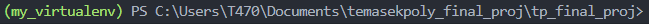

## First gitclone the repository to your project path location

git clone https://github.com/HassanHosain/tp_final_proj.git

## once the git clone is created a folder called tp_final_proj will be created open that folder

## Secondly within the folder tp_final_proj create the virtual environment, we will be naming the virtual environment my_virtualenv

python -m venv my_virtualenv

## Thirdly activate the virtual environment 

./my_virtualenv/Scripts/activate

## Lastly once the virtual environment is activated you will see a similar picture below 

## Now for first time installation you can do so by using below commands
pip install -r requirements.txt

## to deactivate the virtual environment 
./my_virtualenv/Scripts/deactivate